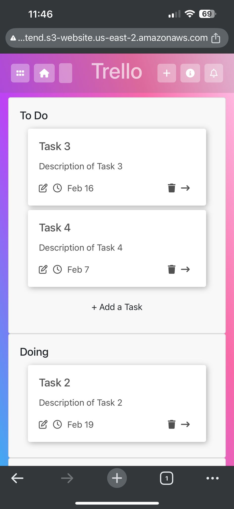

# Trello Clone

A task management app inspired by Trello, built using **React.js** for the frontend (hosted on **AWS S3** and **EC2**) and **Spring Boot** for the backend (hosted on **AWS Elastic Beanstalk**). It utilizes **AWS RDS** for PostgreSQL database management. The app allows users to create boards, lists, and cards for task organization, without user authentication

## Tech Stack:
- **Frontend:** React.js (hosted on AWS S3 & EC2)
- **Backend:** Spring Boot (hosted on AWS Elastic Beanstalk)
- **Database:** AWS RDS (PostgreSQL)
